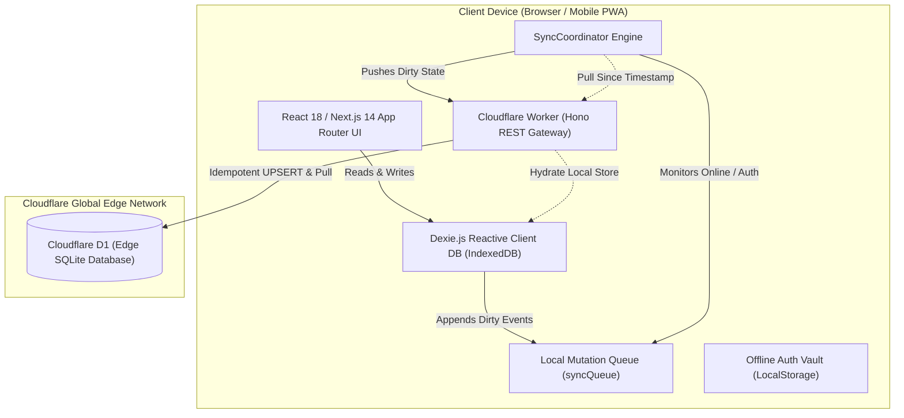
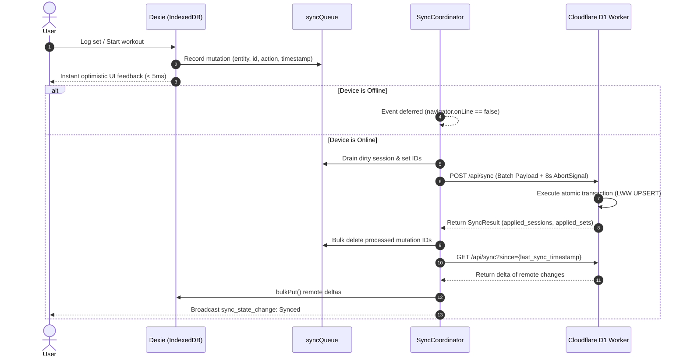

<div align="center">

# 🏋️ NextSet

**A high-performance, offline-first gym companion engineered for instantaneous workout logging, barbell plate computation, and low-latency edge synchronization.**

[](https://www.typescriptlang.org/)
[](https://nextjs.org/)
[](https://developers.cloudflare.com/)
[](https://dexie.org/)
[](https://web.dev/progressive-web-apps/)
[](./LICENSE)

[Live PWA](https://nextset-4u3.pages.dev) • [Edge API](https://nextset-api-production.rishabraj2211.workers.dev) • [Architecture](#-system-architecture) • [Sync Protocol](#-offline-first-synchronization-protocol) • [Database Schema](#-database-schema) • [Algorithms](#-mathematical-formulations--algorithms) • [API Reference](#-api-endpoint-reference)

</div>

---

## 📋 Table of Contents

1. [System Architecture](#-system-architecture)
2. [Offline-First Synchronization Protocol](#-offline-first-synchronization-protocol)
3. [Database Schema (D1 & IndexedDB)](#-database-schema)
4. [Authentication & Cryptography](#-authentication--cryptography-architecture)
5. [Mathematical Formulations & Algorithms](#-mathematical-formulations--algorithms)
   - [Hybrid 1RM Estimation (Epley / Brzycki)](#1-hybrid-one-rep-max-1rm-estimation)
   - [Barbell Plate Math Greedy Allocation](#2-barbell-plate-math-greedy-allocation)
   - [Dual-Axis PR Detection Engine](#3-dual-axis-personal-record-pr-detection)
6. [Design System & Stacking Context](#-design-system--theming-architecture)
7. [Monorepo Structure](#-monorepo-structure)
8. [Getting Started & Local Development](#-getting-started--local-development)
9. [Deployment & Containerization](#-deployment--devops)
10. [API Endpoint Reference](#-api-endpoint-reference)

---

## 🏛️ System Architecture

NextSet is architected as an **offline-first, client-driven distributed application**. The primary storage layer is local-first on the client's device using browser IndexedDB via Dexie.js. The edge layer acts as an idempotent backup and multi-device relay engine powered by Cloudflare Workers and Cloudflare D1 (distributed SQLite).



### Core Architecture Highlights

- **Zero-Blocking UX**: Every workout set toggle, weight increment, and exercise swap completes synchronously in memory and IndexedDB within `< 5ms`.
- **Stateless Edge Worker**: The backend is hosted across 300+ Cloudflare edge locations with cold starts `< 10ms`.
- **Zero Heavy Dependencies**: Cryptography, token verification, and math calculations utilize native Web standards (Web Crypto API, Web Audio API, Navigator Haptics, and standard CSS variables).

---

## 🔄 Offline-First Synchronization Protocol

NextSet guarantees that all workout actions succeed regardless of internet connection status.



### 1. The Local Mutation Queue
Every mutating operation in `apps/web/src/lib/db/workoutStore.ts` wraps the entity creation and the queue insertion in a single atomic Dexie transaction:

```typescript
await db.transaction('rw', db.workoutSessions, db.workoutSets, db.syncQueue, async () => {
  await db.workoutSets.put(newSet);
  await db.syncQueue.add({
    entity_type: 'set',
    entity_id: newSet.id,
    action: 'update',
    timestamp: new Date().toISOString(),
  });
});
```

### 2. Conflict Resolution: Last-Write-Wins (LWW)
Conflicts between multiple devices are resolved deterministically using **monotonic ISO-8601 timestamps** (`updated_at`):

```sql
INSERT INTO workout_sets (id, session_id, exercise_id, weight_value, reps, updated_at, deleted)
VALUES (?, ?, ?, ?, ?, ?, ?)
ON CONFLICT(id) DO UPDATE SET
  weight_value = excluded.weight_value,
  reps = excluded.reps,
  updated_at = excluded.updated_at,
  deleted = excluded.deleted
WHERE excluded.updated_at >= workout_sets.updated_at;
```

### 3. Connection & Auth Life-Cycle Hooks
- **Network Recovery Hook**: Listens to browser `window.addEventListener('online')` to immediately trigger a sync flush when exiting an offline gym area.
- **Authentication Debouncing**: Listens to custom auth events (`nextset_auth_change`) with a 200ms debounce timer to prevent race conditions during login/logout cycles.
- **Timeout Protection**: All network requests to `/api/sync` are wrapped with `AbortSignal.timeout(8000)` to ensure hanging cellular connections do not lock the UI.

---

## 🗄️ Database Schema

### Cloudflare D1 Relational Schema (`apps/api/schema.sql`)

```sql
CREATE TABLE IF NOT EXISTS users (
    id TEXT PRIMARY KEY,
    email TEXT UNIQUE NOT NULL,
    password_hash TEXT,
    password_salt TEXT,
    name TEXT,
    unit_preference TEXT NOT NULL DEFAULT 'kg',
    barbell_weight REAL NOT NULL DEFAULT 20.0,
    created_at TEXT NOT NULL,
    updated_at TEXT NOT NULL
);

CREATE TABLE IF NOT EXISTS magic_codes (
    email TEXT PRIMARY KEY,
    code TEXT NOT NULL,
    anonymous_user_id TEXT,
    expires_at TEXT NOT NULL,
    created_at TEXT NOT NULL
);

CREATE TABLE IF NOT EXISTS workout_sessions (
    id TEXT PRIMARY KEY,
    user_id TEXT NOT NULL,
    title TEXT NOT NULL,
    started_at TEXT NOT NULL,
    ended_at TEXT,
    status TEXT NOT NULL CHECK(status IN ('active', 'completed', 'abandoned')),
    notes TEXT,
    created_at TEXT NOT NULL,
    updated_at TEXT NOT NULL,
    deleted INTEGER NOT NULL DEFAULT 0
);

CREATE TABLE IF NOT EXISTS workout_sets (
    id TEXT PRIMARY KEY,
    session_id TEXT NOT NULL REFERENCES workout_sessions(id) ON DELETE CASCADE,
    exercise_id TEXT NOT NULL,
    set_number INTEGER NOT NULL,
    set_type TEXT NOT NULL CHECK(set_type IN ('warmup', 'working', 'drop', 'myorep')),
    weight_value REAL NOT NULL,
    weight_unit TEXT NOT NULL CHECK(weight_unit IN ('kg', 'lbs')),
    reps INTEGER NOT NULL,
    rpe REAL,
    notes TEXT,
    completed INTEGER NOT NULL DEFAULT 0,
    completed_at TEXT,
    created_at TEXT NOT NULL,
    updated_at TEXT NOT NULL,
    deleted INTEGER NOT NULL DEFAULT 0
);

-- Indexing for O(log N) Delta Queries & Sync Filtering
CREATE INDEX IF NOT EXISTS idx_sessions_user_status ON workout_sessions(user_id, status);
CREATE INDEX IF NOT EXISTS idx_sessions_updated_at ON workout_sessions(updated_at);
CREATE INDEX IF NOT EXISTS idx_sets_session ON workout_sets(session_id);
CREATE INDEX IF NOT EXISTS idx_sets_exercise ON workout_sets(exercise_id);
CREATE INDEX IF NOT EXISTS idx_sets_updated_at ON workout_sets(updated_at);
```

### IndexedDB Store Definition (`apps/web/src/lib/db/index.ts`)

Dexie.js manages local client storage with identical indexing:
- `workoutSessions`: `&id, user_id, status, started_at, updated_at, deleted`
- `workoutSets`: `&id, session_id, exercise_id, set_number, completed, updated_at, deleted`
- `syncQueue`: `++id, entity_type, entity_id, action, timestamp`

---

## 🔐 Authentication & Cryptography Architecture

NextSet requires **zero external identity providers** (no Firebase, Supabase, or Auth0 overhead). All security routines are implemented directly on runtime Web Crypto APIs.

```text
Password Input ───► PBKDF2 (SHA-256, 100,000 Iterations, 16-byte CSPRNG Salt) ───► Stored Hash
Session Auth   ───► HMAC-SHA256 (Secret Key, Base64Url JWT Header + Payload) ────► Bearer Token
Magic Links    ───► 6-Digit Cryptographic Random OTP (15-Minute TTL) ─────────────► One-Time Login
```

1. **Password Derivation**:
   - Algorithm: `PBKDF2` with `HMAC-SHA256`.
   - Iteration Count: `100,000` rounds.
   - Salt: 16 bytes generated via `crypto.getRandomValues(new Uint8Array(16))`.
2. **Stateless JWT Tokens**:
   - Signature: `HMAC-SHA256`.
   - Payload: `{ sub: userId, email, exp: now + 30 days }`.
   - Verification: Runs at edge in `< 1ms` inside Cloudflare Workers without touching database tables.
3. **Local Vault Offline Fallback**:
   - When the user is completely offline without a connection to the Cloudflare Worker, `authStore.ts` checks a local cryptographic vault (`nextset_local_accounts_vault`) in `localStorage` to allow seamless login and workout access.

---

## 🧮 Mathematical Formulations & Algorithms

### 1. Hybrid One-Rep Max (1RM) Estimation

Standard strength formulas behave differently depending on the rep bracket:
- **Brzycki** is widely regarded as superior for low reps ($\le 6$) but diverges unrealistically above 10 reps.
- **Epley** provides reliable estimates in higher hypertrophy rep ranges ($7 \text{ to } 15$).

NextSet employs a **Hybrid Weighted Model** in [apps/web/src/lib/strengthMath.ts](file:///home/rishab/Personal/WebDev/NextSet/apps/web/src/lib/strengthMath.ts):

$$\text{Epley}(W, R) = W \cdot \left(1 + \frac{R}{30}\right)$$

$$\text{Brzycki}(W, R) = W \cdot \left(\frac{36}{37 - R}\right) \quad \text{for } R < 37$$

$$\text{Estimated 1RM} = \begin{cases} 
0.6 \cdot \text{Brzycki} + 0.4 \cdot \text{Epley} & \text{if } R \le 6 \\ 
0.7 \cdot \text{Epley} + 0.3 \cdot \text{Brzycki} & \text{if } R > 6 
\end{cases}$$

From the calculated 1RM, the engine derives 8 discrete strength percentage zones:
- **100% (1 rep)**: Maximum Neural Output
- **90% (3 reps)**: Strength & Power Zone
- **80% (8 reps)**: Moderate Hypertrophy
- **70% (12 reps)**: Metabolic Stress & Endurance

---

### 2. Barbell Plate Math Greedy Allocation

Barbell plate computation is implemented as a **bounded greedy change-making algorithm** in [apps/web/src/lib/plateMath.ts](file:///home/rishab/Personal/WebDev/NextSet/apps/web/src/lib/plateMath.ts):

$$\text{Weight Per Side} = \frac{\text{Target Weight} - \text{Barbell Weight}}{2}$$

The algorithm traverses an ordered inventory of standard Olympic plate weights, taking the maximal count for each denomination before descending:

| Weight (Metric) | Weight (Imperial) | Olympic Color | Visual Height Ratio |
| :--- | :--- | :--- | :--- |
| **25 kg** | — | 🔴 Red (`#ef4444`) | `1.00` (450mm full bumper) |
| **20 kg** | **45 lbs** | 🔵 Blue (`#3b82f6`) | `1.00` (450mm full bumper) |
| **15 kg** | **35 lbs** | 🟡 Yellow (`#eab308`) | `0.90` |
| **10 kg** | **25 lbs** | 🟢 Green (`#10b981`) | `0.80` |
| **5 kg** | **10 lbs** | ⚪ White (`#f8fafc`) | `0.65` |
| **2.5 kg** | **5 lbs** | ⬛ Slate (`#334155`) | `0.52` |
| **1.25 kg** | **2.5 lbs** | 🔘 Grey (`#94a3b8`) | `0.42` |

Visual rendering leverages the `heightRatio` to draw true-to-scale bumper diameters directly in CSS.

---

### 3. Dual-Axis Personal Record (PR) Detection

When a workout set is checked off, NextSet evaluates historical performance across two independent axes in $O(N)$ time:
1. **Absolute Weight PR**: `currentSet.weight > max(historicalSets.weight)`
2. **Calculated 1RM PR**: `current1RM > max(historicalSets.1RM)`

This ensures lifters receive credit both for moving heavier absolute loads and for executing volume PRs (e.g., hitting 80kg for 10 reps yields a higher 1RM than 85kg for 5 reps).

---

## 🎨 Design System & Theming Architecture

### Zero-Runtime Design Tokens (`apps/web/src/styles/tokens.css`)

All styling uses pure CSS custom properties to ensure 60fps rendering without CSS-in-JS runtime overhead:

```css
:root {
  /* Surface System */
  --bg-primary: #0b0d18;
  --bg-surface: #141724;
  --bg-surface-elevated: #1b1f2e;

  /* Strict Z-Index Scale */
  --z-base: 1;
  --z-card: 10;
  --z-topbar: 30;
  --z-sticky-bar: 50;
  --z-dock: 80;
  --z-modal-backdrop: 90;
  --z-modal: 100;
  --z-overlay: 1000;
}
```

### Stacking Context Hierarchy
To eliminate dropdown bleeding and popover clipping:
- `.topBar` operates at `z-index: 30`.
- Downstream hero banners and cards operate at `z-index: 2`.
- Modal and confirmation dialog overlays render at `z-index: 1000`.

### Surface & Palette Modes
- **Surfaces**: `Obsidian Dark` (`#0b0d18`), `Midnight Navy` (`#080c16`), `OLED Black` (`#000000`), `Gunmetal Slate` (`#0f172a`).
- **Accents**: 12 curated palettes (`lavender`, `sage`, `coral`, `peach`, `sky`, `buttercup`, `crimson`, `cobalt`, `emerald`, `amber`, `monochrome`, `violet`).

---

## 📁 Monorepo Structure

```text
NextSet/
├── apps/
│   ├── web/                         # Frontend Web App (Next.js 14)
│   │   ├── src/
│   │   │   ├── app/                 # Next.js App Router (Root layout, viewport, metadata)
│   │   │   ├── components/          # Reusable UI components
│   │   │   │   ├── ActiveWorkout.tsx         # Workout engine & set recorder
│   │   │   │   ├── PlateCalculatorModal.tsx  # Barbell loading engine
│   │   │   │   ├── StrengthCurveModal.tsx    # 1RM curves & power zones
│   │   │   │   ├── MuscleMap.tsx             # 2D anatomical SVG body map
│   │   │   │   ├── RestTimer.tsx             # Interval clock with audio/haptics
│   │   │   │   ├── SyncStatusButton.tsx      # Real-time sync & backup status
│   │   │   │   └── SettingsPage.tsx          # Preferences & JSON data export
│   │   │   ├── lib/                 # Core domain logic
│   │   │   │   ├── db/              # Dexie.js database & schema definition
│   │   │   │   ├── sync/            # SyncCoordinator push/pull protocol
│   │   │   │   ├── auth/            # AuthStore & offline vault
│   │   │   │   ├── plateMath.ts     # Greedy plate distribution algorithm
│   │   │   │   ├── strengthMath.ts  # Hybrid 1RM & PR detection engine
│   │   │   │   └── themeStore.ts    # Surface & accent palette manager
│   │   │   ├── styles/              # Design tokens, reset, & theme CSS
│   │   │   └── data/                # 100+ exercise directory with muscle tags
│   │   └── public/                  # Static assets, PWA manifest, service worker
│   │
│   └── api/                         # Edge API Backend (Cloudflare Workers)
│       ├── src/
│       │   ├── index.ts             # Hono REST API router & middleware
│       │   ├── db.ts                # Cloudflare D1 query helpers
│       │   └── auth.ts              # Web Crypto PBKDF2 & HMAC-SHA256 JWT
│       ├── schema.sql               # SQLite relational schema
│       └── wrangler.toml            # Cloudflare deployment settings
│
├── packages/
│   └── shared/                      # Universal Types & Contracts
│       └── src/
│           ├── types.ts             # WorkoutSession, WorkoutSet, Exercise, etc.
│           └── index.ts             # Re-export module
│
├── .github/workflows/ci.yml         # GitHub Actions automated test & build pipeline
├── Dockerfile                       # Multi-stage production Nginx container build
├── docker-compose.yml               # Container orchestration
├── nginx.conf                       # Optimized Nginx config with cache headers
├── package.json                     # Monorepo workspaces definition
└── tsconfig.json                    # Base TypeScript compiler options
```

---

## 🚀 Getting Started & Local Development

### Prerequisites

- **Node.js**: `>= 20.0.0`
- **npm**: `>= 10.0.0`
- **Cloudflare Wrangler CLI**: (Optional, for local D1 database emulation)

### Step-by-Step Setup

1. **Clone the repository**:
   ```bash
   git clone https://github.com/your-username/nextset.git
   cd nextset
   ```

2. **Install all dependencies**:
   ```bash
   npm install
   ```

3. **Configure environment variables**:
   ```bash
   cp apps/web/.env.example apps/web/.env.local
   cp apps/api/.env.example apps/api/.dev.vars
   ```

4. **Launch development servers**:
   ```bash
   # Run the Next.js PWA client (http://localhost:3000)
   npm run dev

   # Run the Cloudflare Worker API locally (http://127.0.0.1:8787)
   npm run dev:api
   ```

5. **Execute tests and type safety checks**:
   ```bash
   # Run unit test suite (Node.js test runner)
   npm test

   # Run TypeScript compilation checks across all workspaces
   npm run typecheck
   ```

---

## 🚢 Deployment & DevOps

### Deploying to Cloudflare (Workers & Pages)

NextSet is natively optimized for Cloudflare's serverless edge infrastructure:

```bash
# Deploy edge API to Cloudflare Workers
npm run deploy:api:prod

# Build static PWA and deploy to Cloudflare Pages
npm run deploy:web

# Deploy both in one command
npm run deploy
```

### Self-Hosting with Docker & Nginx

NextSet includes a multi-stage `Dockerfile` and `docker-compose.yml` for self-hosting on any Linux VPS (Ubuntu, Debian, Alpine):

```bash
# Build and run the web container on port 80
docker-compose up -d --build
```

The embedded [nginx.conf](file:///home/rishab/Personal/WebDev/NextSet/nginx.conf) includes:
- Gzip compression for JS, CSS, and SVG files.
- Static asset caching (`Cache-Control: public, max-age=31536000, immutable`).
- `Cache-Control: no-cache` on `sw.js` to ensure instantaneous service worker updates.

---

## 📡 API Endpoint Reference

The edge API is mounted at `/api` and built with **Hono**:

| Method | Endpoint | Auth | Description |
| :--- | :--- | :---: | :--- |
| `POST` | `/api/auth/register` | None | Create account with email and password |
| `POST` | `/api/auth/login` | None | Authenticate with email/password and receive JWT |
| `POST` | `/api/auth/otp/send` | None | Generate and dispatch 6-digit OTP code |
| `POST` | `/api/auth/otp/verify` | None | Verify OTP code and establish authenticated session |
| `POST` | `/api/sync` | Bearer / Anon | Ingest batch of dirty sessions and sets (LWW UPSERT) |
| `GET` | `/api/sync?since={ts}` | Bearer / Anon | Pull remote changes updated after given timestamp |
| `GET` | `/api/user/stats` | Bearer | Compute aggregate volume, total sessions, and logged sets |
| `PUT` | `/api/user/preferences` | Bearer | Update weight unit (`kg`/`lbs`) and standard barbell tare |
| `PUT` | `/api/user/password` | Bearer | Verify existing password and apply newly hashed credentials |

---

## 📄 License

This project is licensed under the **MIT License** — see the [LICENSE](./LICENSE) file for complete details.
